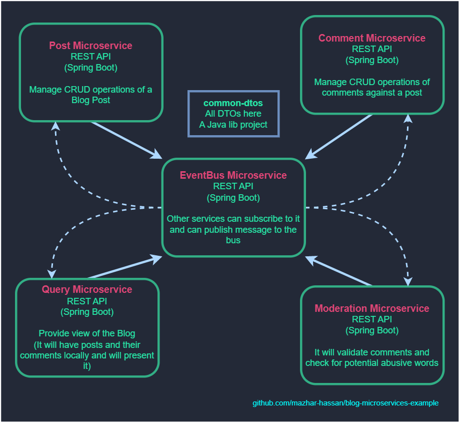
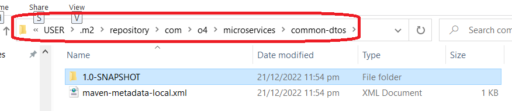
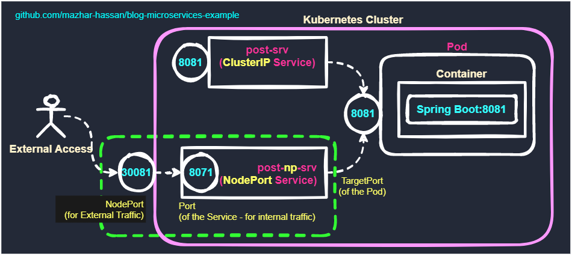
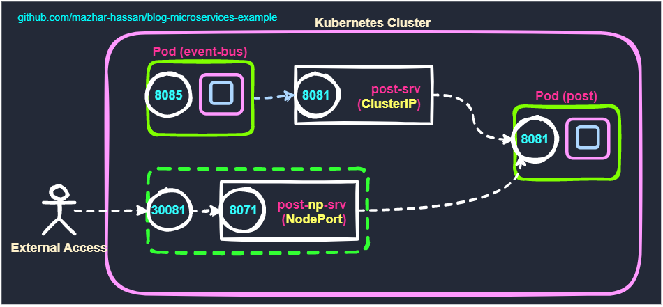
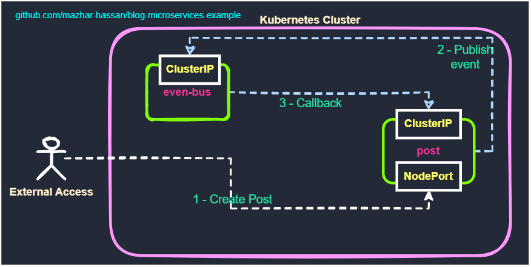
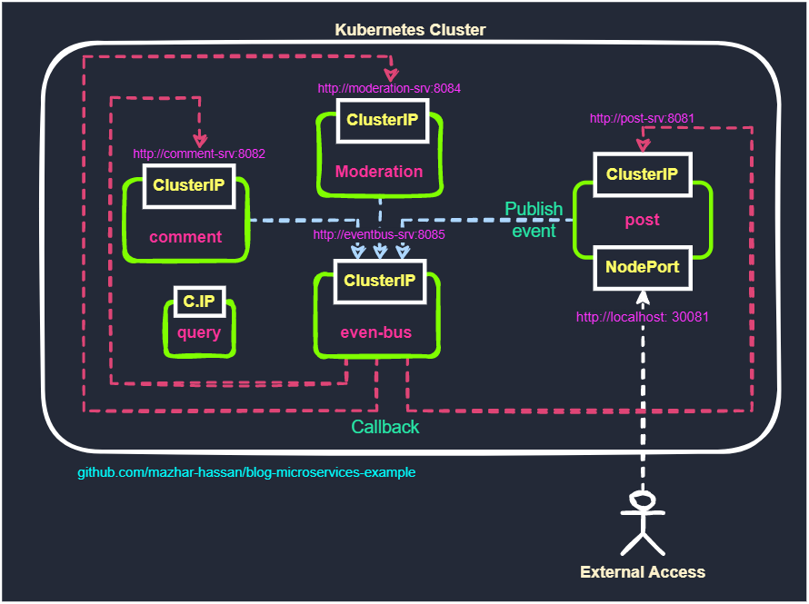

# blog-microservices-example
It's a sample microservices example repository contains multiple spring boot projects

This repository contains 5 service and 1 Library project and all the data contains within the memory as not database is associated right now.

## Plan
* Dockerize our spring boot application
* Optimizae dockerazation process in a way, if dependencies are already download and built in a layer must not process them again
* Write K8 deployment script for each service
* Deploy k8-deployments on local machine with deployment scripts and run full flow
* Use Skaffold to run with single command (Development only)
* Bring a production grade tool for the deployment of K8 services

# Services

## 1 - common-dtos
This is a Java library project and contains all the DTOs that are common all the 5 microservices.
Microservices are dependent on this libaray project, right now it cannot not be published anywhere hence we have to publish it in local m2 repository.

`mvn clean install`

Use above command to install this lib project in local m2 directory

Great now our other projects when need this dependency they will get it from local m2 repository

Here this snapshot folder contains our JAR file which will be used by other projects as dependency (microservices)

    <dependency>
        <groupId>com.o4.microservices</groupId>
        <artifactId>common-dtos</artifactId>
        <version>1.0-SNAPSHOT</version>
    </dependency>

## 2 - post-service
http://localhost:8081

Post service contains all the CRUD operations (right now only create and list)

Listens
* Ignore all events
* POST /public/bus-event - A web hook for event listner

Publish
* POST_CREATED

### Exposes
* POST /api/v1/posts - To create a new post
* GET /api/v1/posts - List existing posts

## 3 -  comment-service
http://localhost:8082

Comment service contains all the CRUD operations (right now only create and list)

Exposes
* POST /api/v1/posts/{postId}/comments
* GET /api/v1/posts/{postId}/comments

Listens
* COMMENT_MODERATED
* POST /public/bus-event - A web hook for event listner

Publish
* COMMENT_CREATED
* COMMENT_UPDATED

## 4 - moderation-service
http://localhost:8084

Exposes
* none

Listens
* COMMENT_CREATED
* POST /public/bus-event - A web hook for event listner

Publish
* COMMENT_MODERATED

## 5 - query-service
http://localhost:8083

Exposes
* GET /api/v1/query/posts - Return list of post with their comments
* GET /api/v1/query/posts/{postId} - Return a post with comments against provided post id

Listens
* COMMENT_CREATED
* POST /public/bus-event - A web hook for event listner

Publish
* COMMENT_MODERATED

## 6 - event-bus
http://localhost:8085

Exposes
 * POST /public/bus-event - Publish an event
 * GET /public/bus-event - list events
 

# Dockerize Services

### Build docker image
Assumption you are in parent folder
* Build docker image and tag with version 01
* Repeat this one by one for all 5 microservices
* Point to child directory where exist the relevant docker file

* `docker build -t blog-post-service:01 -f post-service/Dockerfile .`
* `docker build -t blog-comment-service:01 -f comment-service/Dockerfile .`
* `docker build -t blog-query-service:01 -f query-service/Dockerfile .`
* `docker build -t blog-moderation-service:01 -f moderation-service/Dockerfile .`
* `docker build -t blog-event-bus:01 -f event-bus/Dockerfile .`

Now all 5 docker images are created locally, we can push them to docker hub or ECR, but for now we will keep them local and use it accordingly

LIST all created Images `docker images`

    REPOSITORY                    TAG     IMAGE ID       CREATED          SIZE
    -----------------------------------------------------------------------------
    blog-event-bus                01      b242de58c8b0   3 minutes ago    477MB
    blog-moderation-service       01      fe2e37bf4057   10 minutes ago   477MB
    blog-query-service            01      ab8d393fbe3a   14 minutes ago   477MB
    blog-comment-service          01      0843828f21d2   21 minutes ago   477MB
    blog-post-service             01      83c2302048c5   28 minutes ago   477MB

### Run docker Container
If you want to test services independenly you can run directly run containers and can access them on the associate ports. You can wait for K8 based deployment coming up next.

* `docker run -d --name mic-post -p 8081:8081 blog-post-service:01`
* `docker run -d --name mic-comment -p 8082:8082 blog-comment-service:01`
* `docker run -d --name mic-query -p 8083:8083 blog-query-service:01`
* `docker run -d --name mic-moderation -p 8084:8084 blog-moderation-service:01`
* `docker run -d --name mic-event-bus -p 8085:8085 blog-event-bus:01`

## Useful commands
#### Show docker images
`docker images`

#### Show running containers
`docker ps`

#### Show running containers and stopped
`docker ps -a`

#### Stop container
`docker stop <container-name>`

`docker stop <container-id>`

#### Remove container
`docker rm <container-name>`

### Start a stopped container
`docker start <container-name>`

### Restart a container
`docker restart <container-name>`

### Start stopped container
`docker start <container-name>`

### Rename container
`docker rename old_name new_name`

### Test a container
We can start a test container for verification etc
`docker run -d --name container-name image_name watch "date >> /var/log/date.log"`

# K8 Deployment
## Deploy post-deployment
`kubectl apply -f infrastructure/post-deployment.yml`

This command will create 2 resources one is deployment and the other one is service
`kubectl get all`

    # [[ SERVICES #kubectl get services ]]
    NAME                 TYPE        CLUSTER-IP      EXTERNAL-IP   PORT(S)          AGE
    service/post-srv     ClusterIP   10.96.225.40    <none>        8081/TCP         4h43m

    # [[ DEPLOYMENTS #kubectl get deployments ]]
    NAME                        READY   UP-TO-DATE   AVAILABLE   AGE
    deployment.apps/post-depl   1/1     1            1           4h43m

    # [[ PODs #kubectl get pods ]]
    NAME                                 DESIRED   CURRENT   READY   AGE
    replicaset.apps/post-depl-cbdb8565   1         1         1       4h43m

**Deployment is there but its not accessible ** beacuse its inside the cluster and you are sitting outside of the k8 cluster

If you look at the above output we have created following items
 * A service of type ClusterIP, this will enable internal services to access post 
 * A deployment that represent the Post microservice
 * A pod which is part of the deployment, that internally running the container, which incl

## Access our "post deployment"
Run following command it will create a NodePort service and exposes it to the external world

`kubectl apply -f infrastructure/post-node-port-service.yml`

`kubectl get all`

    # [[ SERVICES #kubectl get services ]]
    NAME                 TYPE        CLUSTER-IP      EXTERNAL-IP   PORT(S)          AGE
    service/post-srv     ClusterIP   10.96.225.40    <none>        8081/TCP         4h43m
    service/post-np-srv    NodePort    10.97.221.159   <none>      8071:30081/TCP   30s

    # [[ DEPLOYMENTS #kubectl get deployments ]]
    NAME                        READY   UP-TO-DATE   AVAILABLE   AGE
    deployment.apps/post-depl   1/1     1            1           4h43m

    # [[ PODs #kubectl get pods ]]
    NAME                                 DESIRED   CURRENT   READY   AGE
    replicaset.apps/post-depl-cbdb8565   1         1         1       4h43m

### Useful commands
* kubectl apply -f configuration-file.yml
* kubectl get deployments
* kubectl describe deployment post-depl
* kubectl get pods
* kubectl delete pod post-depl-23232323
* `kubectl rollout restart deployment post-depl`

### Access service through node port
http://localhost:30081/api/v1/posts

## Deployment for event bus
`kubectl apply -f infrastructure/event-bus-deployment.yml`

* deployment.apps/eventbus-depl created
* service/eventbus-srv created

`kubectl rollout restart deployment eventbus-depl`

## Deployment of Post
Deployment files are updated with clusterIP configuration in service area
we will update both eventbus-depl and post-depl in following way
* Update the codebase of eventbus so that it uses http://post-srv for callback to the post service.
* Update the codebase of post os that it uses http://eventbus-srv tp publish event.
* Please remember ClusterIP is only internal services are exposing each other and not accessible from outside
* In order to access it from outside, we will use our previous NodePort configuration we created for post
* We will create post using NodePort technique
* Post service will internally call the eventbus service using ClusterIP
* EventBus will internally call back post service using ClusterIP

## Simplified Diagram

`kubectl apply -f infrastructure/post-deployment.yml`
* deployment.apps/post-depl created
* service/post-srv created

`kubectl get pods`

To check the logs if we received the event

`kubectl logs eventbus-depl-xcxkcjxkjc-xcxc`

## Update remaining services
`kubectl apply -f infrastructure/comment-deployment.yml`
* deployment.apps/comment-depl created
* service/comment-srv created

`kubectl apply -f infrastructure/moderation-deployment.yml`
* deployment.apps/moderation-depl created
* service/moderation-srv created

`kubectl apply -f infrastructure/query-deployment.yml`
* deployment.apps/query-depl created
* service/query-srv created

### Apply all configuration at once
`cd infrastructure`

`kubectl apply -f .`

    D:\code\k8\blog-microservices-example\infrastructure>kubectl apply -f .
    deployment.apps/comment-depl created
    service/comment-srv created
    deployment.apps/eventbus-depl created
    service/eventbus-srv created
    ingress.networking.k8s.io/ingress-srv unchanged
    deployment.apps/moderation-depl created
    service/moderation-srv created
    deployment.apps/post-depl created
    service/post-srv created
    service/post-np-srv created
    deployment.apps/query-depl created
    service/query-srv created

### Restart eventbus deployment
`kubectl rollout restart deployment eventbus-depl`

* Comment, eventbus, moderation and query service type is **"ClusterIP"**
* Post service has one **"ClusterIP"** service for internal access
* Post service has another **"NodePort"** for external access through port number

## Load Balancer Service
* When load balancer service is applied to cluster
* Cluster request cloud provider AWS, Azure or Google
* Cloud provider provision a load balancer outside of cluster
* External clients can communicate through this provisioned load balancer
* Load balancer then forward the request to respective resource

## Ingress Controller

### ingress-nginx
Opensource project that will help use create Load Balancer and an ingress

https://kubernetes.github.io/ingress-nginx/

https://kubernetes.github.io/ingress-nginx/deploy/#quick-start

### Install Ingress Nginx
`kubectl apply -f https://raw.githubusercontent.com/kubernetes/ingress-nginx/controller-v1.1.1/deploy/static/provider/cloud/deploy.yaml`
* namespace/ingress-nginx created
* serviceaccount/ingress-nginx created
* configmap/ingress-nginx-controller created
* clusterrole.rbac.authorization.k8s.io/ingress-nginx created
* clusterrolebinding.rbac.authorization.k8s.io/ingress-nginx created
* role.rbac.authorization.k8s.io/ingress-nginx created
* rolebinding.rbac.authorization.k8s.io/ingress-nginx created
* service/ingress-nginx-controller-admission created
* service/ingress-nginx-controller created
* deployment.apps/ingress-nginx-controller created
* ingressclass.networking.k8s.io/nginx created
* validatingwebhookconfiguration.admissionregistration.k8s.io/ingress-nginx-admission created
* serviceaccount/ingress-nginx-admission created
* clusterrole.rbac.authorization.k8s.io/ingress-nginx-admission created
* clusterrolebinding.rbac.authorization.k8s.io/ingress-nginx-admission created
* role.rbac.authorization.k8s.io/ingress-nginx-admission created
* rolebinding.rbac.authorization.k8s.io/ingress-nginx-admission created
* job.batch/ingress-nginx-admission-create created
* job.batch/ingress-nginx-admission-patch created

### Preflight check
`kubectl get pods --namespace=ingress-nginx`

## Configuring every thing
1. Update prefix for comment service to /api/v1/pc
2. Update prefix for query service to /api/v1/query
3. Rebuild comment-service image `docker build -t blog-comment-service:01 -f comment-service/Dockerfile .`
4. Rebuild query-service image `docker build -t blog-query-service:01 -f query-service/Dockerfile .`
5. Restart comment deployment `kubectl rollout restart deployment comment-depl`
6. Restart query deployment `kubectl rollout restart deployment query-depl`
7. Update `ingress-srv.yml` with new paths as prefix
8. Apply ingress changes `kubectl apply -f infrastructure/ingress-srv.yml`

### Update host file
open host file
`C:\Windows\System32\drivers\etc\hosts` or `/etc/hosts`
add following entry

`127.0.0.1 local.blog.com`

## Test application
Now you can access the URLs
#### Create Post
* POST http://local.blog.com/api/v1/posts
#### Create Comment
* POST http://local.blog.com/api/v1/pc/2348b232-5cc8-4af9-b3d4-f61208bfbe86/comments
#### Access Data
* GET http://local.blog.com/api/v1/query/posts
* GET http://local.blog.com/api/v1/query/posts/2348b232-5cc8-4af9-b3d4-f61208bfbe86

## Postman project file
In order to make above call through Postman, you can use this file and import to your postman
[Postman File](#artifacts/blog-microservices.postman_collection.json)

### Skaffold
Check the website and install according to your operating systems
for windows
Download following file and rename it to and place in your path
https://storage.googleapis.com/skaffold/releases/latest/skaffold-windows-amd64.exe

#### Configuration 
Create skaffold.yml file and enter the contents [Skaffold](skaffold.yaml)

`skaffold build`

#### Run every thing
`skaffold dev`

### Error running skaffold
#### Validation error

Error from server (InternalError): error when creating "STDIN": Internal error occurred: failed calling webhook "validate.nginx.ingress.kubernetes.io": Post "https://ingress-nginx-controller-admission.ingress-nginx.svc:443/networking/v1/ingresses?timeout=10s": context deadline exceeded

run following command
`kubectl delete -A ValidatingWebhookConfiguration ingress-nginx-admission`

