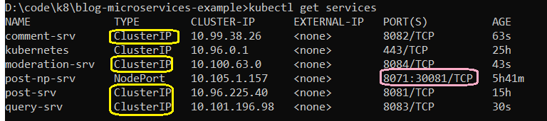

# blog-microservices-example
It's a sample microservices example repository contains multiple spring boot projects

This repository contains 5 service and 1 Library project

## 0 - common-dtos
`mvn clean install`

User above command to install this lib project in local m2 directory

## 1 - post-service
http://localhost:8081

## 2 -  comment-service
http://localhost:8082

Exposes
* POST /api/v1/posts/{postId}/comments
* GET /api/v1/posts/{postId}/comments

Listens
* COMMENT_MODERATED

Publish
* COMMENT_UPDATED

## 3 - moderation-service
http://localhost:8084

Exposes
* none

Listens
* COMMENT_CREATED

Publish
* COMMENT_MODERATED

## 4 - query-service
http://localhost:8083

## 5 - event-bus
http://localhost:8085

# Dockerize Services

### Build docker image
Assumption you are in parent folder
* Build docker image
* Tag it with mic-qs
* With version 01
* Point to child directory where exist the relevant docker file

* `docker build -t blog-post-service:01 -f post-service/Dockerfile .`
* `docker build -t blog-comment-service:01 -f comment-service/Dockerfile .`
* `docker build -t blog-query-service:01 -f query-service/Dockerfile .`
* `docker build -t blog-moderation-service:01 -f moderation-service/Dockerfile .`
* `docker build -t blog-event-bus:01 -f event-bus/Dockerfile .`

### Run docker Container
* `docker run -d --name mic-post -p 8081:8081 blog-post-service:01`
* `docker run -d --name mic-comment -p 8082:8082 blog-comment-service:01`
* `docker run -d --name mic-query -p 8083:8083 blog-query-service:01`
* `docker run -d --name mic-moderation -p 8084:8084 blog-moderation-service:01`
* `docker run -d --name mic-event-bus -p 8085:8085 blog-event-bus:01`

### Useful commands
#### Show docker images
`docker images`

#### Show running containers
`docker ps`

#### Show running containers and stopped
`docker ps -a`

#### Stop container
`docker stop <container-name>`

`docker stop <container-id>`

#### Remove container
`docker rm <container-name>`

### Start a stopped container
`docker start <container-name>`

### Restart a container
`docker restart <container-name>`

### Start stopped container
`docker start <container-name>`

### Rename container
`docker rename old_name new_name`

### Test a container
We can start a test container for verification etc
`docker run -d --name container-name image_name watch "date >> /var/log/date.log"`

## K8 Deployment
### Deploy post-deployment
`kubectl apply -f infrastructure/post-deployment.yml`

#### Useful commands
* kubectl apply -f configuration-file.yml
* kubectl get deployments
* kubectl describe deployment post-depl
* kubectl get pods
* kubectl delete pod post-depl-23232323

`kubectl rollout restart deployment post-depl`

`kubectl apply -f infrastructure/post-service.yml`

* kubectl get services

|NAME            |TYPE        |CLUSTER-IP      |EXTERNAL-IP   |PORT(S)          |AGE    |
|----------------|------------|----------------|--------------|-----------------|-------|
|posts-srv       |NodePort    |10.98.51.238    |\<none>        |8081:31496/TCP   |49s    |

#### Access service through node port
http://localhost:31496/api/v1/posts

### NodePort
#### Deployment for event bus
`kubectl apply -f infrastructure/event-bus-deployment.yml`
* deployment.apps/eventbus-depl created
* service/eventbus-srv created

`kubectl rollout restart deployment eventbus-depl`

* `kubectl get services`

### Cluster IP
#### Deployment of Post
deployment files are updated with clusterIP configuration in service area
we will update both eventbus-depl and post-depl in following way
* Update the codebase of eventbus so that it uses http://post-srv for callback to the post service.
* Update the codebase of post os that it uses http://eventbus-srv tp publish event.
* Please remember ClusterIP is only internal services are exposing each other and not accessible from outside
* In order to access it from outside, we will use our previous NodePort configuration we created for post
* We will create post using NodePort technique
* Post service will internally call the eventbus service using ClusterIP
* EventBus will internally call back post service using ClusterIP

`kubectl apply -f infrastructure/post-deployment.yml`
* deployment.apps/post-depl created
* service/post-srv created

`kubectl get pods`

To check the logs if we received the event

`kubectl logs eventbus-depl-xcxkcjxkjc-xcxc`

### Update remaining services
`kubectl apply -f infrastructure/comment-deployment.yml`
* deployment.apps/comment-depl created
* service/comment-srv created

`kubectl apply -f infrastructure/moderation-deployment.yml`
* deployment.apps/moderation-depl created
* service/moderation-srv created

`kubectl apply -f infrastructure/query-deployment.yml`
* deployment.apps/query-depl created
* service/query-srv created

### Apply all configuration at once
`cd infrastructure`

`kubectl apply -f .`

### Restart eventbus deployment
`kubectl rollout restart deployment eventbus-depl`

* Comment, eventbus, moderation and query service type is **"ClusterIP"**
* Post service has one **"ClusterIP"** service for internal access
* Post service has another **"NodePort"** for external access through port number

## Load Balancer Service
* When load balancer service is applied to cluster
* Cluster request cloud provider AWS, Azure or Google
* Cloud provider provision a load balancer outside of cluster
* External clients can communicate through this provisioned load balancer
* Load balancer then forward the request to respective resource

## Ingress Controller

### ingress-nginx
Opensource project that will help use create Load Balancer and an ingress

https://kubernetes.github.io/ingress-nginx/

https://kubernetes.github.io/ingress-nginx/deploy/#quick-start

### Install Ingress Nginx
`kubectl apply -f https://raw.githubusercontent.com/kubernetes/ingress-nginx/controller-v1.1.1/deploy/static/provider/cloud/deploy.yaml`
* namespace/ingress-nginx created
* serviceaccount/ingress-nginx created
* configmap/ingress-nginx-controller created
* clusterrole.rbac.authorization.k8s.io/ingress-nginx created
* clusterrolebinding.rbac.authorization.k8s.io/ingress-nginx created
* role.rbac.authorization.k8s.io/ingress-nginx created
* rolebinding.rbac.authorization.k8s.io/ingress-nginx created
* service/ingress-nginx-controller-admission created
* service/ingress-nginx-controller created
* deployment.apps/ingress-nginx-controller created
* ingressclass.networking.k8s.io/nginx created
* validatingwebhookconfiguration.admissionregistration.k8s.io/ingress-nginx-admission created
* serviceaccount/ingress-nginx-admission created
* clusterrole.rbac.authorization.k8s.io/ingress-nginx-admission created
* clusterrolebinding.rbac.authorization.k8s.io/ingress-nginx-admission created
* role.rbac.authorization.k8s.io/ingress-nginx-admission created
* rolebinding.rbac.authorization.k8s.io/ingress-nginx-admission created
* job.batch/ingress-nginx-admission-create created
* job.batch/ingress-nginx-admission-patch created

### Preflight check
`kubectl get pods --namespace=ingress-nginx`

### Configuring every thing
1. Update prefix for comment service to /api/v1/pc
2. Update prefix for query service to /api/v1/query
3. Rebuild comment-service image `docker build -t blog-comment-service:01 -f comment-service/Dockerfile .`
4. Rebuild query-service image `docker build -t blog-query-service:01 -f query-service/Dockerfile .`
5. Restart comment deployment `kubectl rollout restart deployment comment-depl`
6. Restart query deployment `kubectl rollout restart deployment query-depl`
7. Update `ingress-srv.yml` with new paths as prefix
8. Apply ingress changes `kubectl apply -f infrastructure/ingress-srv.yml`

### Update host file
open host file
`C:\Windows\System32\drivers\etc\hosts` or `/etc/hosts`
add following entry

`127.0.0.1 local.blog.com`

Now you can access the URLs
#### Create Post
* POST http://local.blog.com/api/v1/posts
#### Create Comment
* POST http://local.blog.com/api/v1/pc/2348b232-5cc8-4af9-b3d4-f61208bfbe86/comments
#### Access Data
* GET http://local.blog.com/api/v1/query/posts
* GET http://local.blog.com/api/v1/query/posts/2348b232-5cc8-4af9-b3d4-f61208bfbe86

